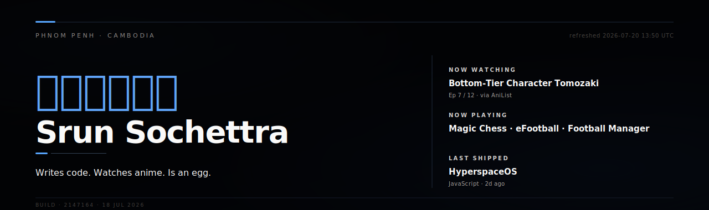

<picture>
  <source media="(prefers-color-scheme: dark)" srcset="./assets/banner-dark.svg" />
  <source media="(prefers-color-scheme: light)" srcset="./assets/banner-light.svg" />
  
</picture>

 

## Selected work

<!--START:PROJECTS-->
<!--END:PROJECTS-->

 

## The year

  

 

## As a coder

**Recent activity**

<!--START:ACTIVITY-->
<!--END:ACTIVITY-->

**Last 7 days**

<!--START:WAKA-->
<!--END:WAKA-->

 

## By the numbers

 

## As a person

**Top anime, in order**

<!--START:ANIME-->
<!--END:ANIME-->

 

<!--START:TIMESTAMP--><!--END:TIMESTAMP-->
