<picture>
  <source media="(prefers-color-scheme: dark)" srcset="./assets/banner-dark.svg" />
  <source media="(prefers-color-scheme: light)" srcset="./assets/banner-light.svg" />
  
</picture>

<b>as a coder</b>

 

<table>
<tr>
<td width="55%" valign="top">

**Recent activity**

<!--START:ACTIVITY-->
<!--END:ACTIVITY-->

</td>
<td width="45%" valign="top">

**Last 7 days**

<!--START:WAKA-->
<!--END:WAKA-->

</td>
</tr>
</table>

<b>as a person</b>

 

**Top anime, in order**

<!--START:ANIME-->
<!--END:ANIME-->

<b>by the numbers</b>

 

<table>
<tr>
<td width="50%" align="center" valign="top">

</td>
<td width="50%" align="center" valign="top">

</td>
</tr>
</table>

<!--START:TIMESTAMP--><!--END:TIMESTAMP-->